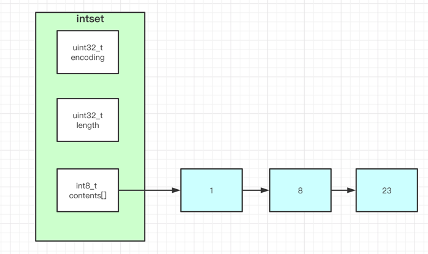

# intset
struct定义如下：
```
typedef struct intset{
    uint32_t encoding;
    uint32_t length;
    int8_t contents[];
}intset;
```
适合场景：
```
当集合中的元素都是整数且元素个数小于set-max-intset-entries配置（默认512个）时，Redis会选用intset来作为集合的内部实现，从而减少内存的使用；
```
intset适合场景，conf 配置如下：
```
➜  cat ~/docker_home/redis/conf/redis.conf | grep --color "set-max-intset-entries"
set-max-intset-entries 512
```

结构图：


# 升级:
```dtd
最节省空间原则，直到遇到有一个int数字比encoding大，才去全体升级encoding。
```

## 升级的好处：
* 最大可能节省内存空间，只有在需要的时候才整体升级；
* 灵活性：C语言静态语言，定好了数据类型就是定好了，但是这个升级策略可以保证你随意往contents数组加不同类型的int，反正它自己会帮你处理encoding。


# 降级：
```
暂不支持
```


# 底层实现：
## 查找元素：
因为要保证整个intset是有序的，所以经常要挪动，要挪动就要知道从哪里开始挪动。定位position代码如下：
```
static uint8_t intsetSearch(intset *is, int64_t value, uint32_t *pos) {
    int min = 0, max = intrev32ifbe(is->length)-1, mid = -1;
    int64_t cur = -1;

    /* 集合为空，直接返回第一个位置 */
    if (intrev32ifbe(is->length) == 0) {
        if (pos) *pos = 0;
        return 0;
    } else {
        /* _intsetGet函数仅仅获取set集合中pos位置的值， 如果待查元素大于集合尾部元素，则直接返回待查元素位置为集合长度*/
        if (value > _intsetGet(is,intrev32ifbe(is->length)-1)) {
            if (pos) *pos = intrev32ifbe(is->length);
            return 0;
        /*如果待查元素小于集合头部元素，则直接返回待查元素位置为0*/
        } else if (value < _intsetGet(is,0)) {
            if (pos) *pos = 0;
            return 0;
        }
    }

    /*二分查找*/
    while(max >= min) {
        mid = ((unsigned int)min + (unsigned int)max) >> 1;
        cur = _intsetGet(is,mid);
        if (value > cur) {
            min = mid+1;
        } else if (value < cur) {
            max = mid-1;
        } else {
            break;
        }
    }
    
    /*找到元素返回1，否则返回0，pos为元素应该位置*/
    if (value == cur) {
        if (pos) *pos = mid;
        return 1;
    } else {
        if (pos) *pos = min;
        return 0;
    }
}
```
其中 `intrev32ifbe` 不用管，他只是帮忙搞定不同操作系统的大端小端，自行脑补以下代码：
```
max = intrev32ifbe(is->length)-1
替换成：
max = is->length-1
```
其中 `is` 自行脑补：
```
is = intset 
```
其中 `max`定义之后， `二分`之前的代码不用管，这是简单的业务优化罢了：
```
/* 集合为空，直接返回第一个位置 */
if (intrev32ifbe(is->length) == 0) {
    if (pos) *pos = 0;
    return 0;
} else {
    /* _intsetGet函数仅仅获取set集合中pos位置的值， 如果待查元素大于集合尾部元素，则直接返回待查元素位置为集合长度*/
    if (value > _intsetGet(is,intrev32ifbe(is->length)-1)) {
        if (pos) *pos = intrev32ifbe(is->length);
        return 0;
    /*如果待查元素小于集合头部元素，则直接返回待查元素位置为0*/
    } else if (value < _intsetGet(is,0)) {
        if (pos) *pos = 0;
        return 0;
    }
}
```
所以最终查找代码可以优化成最常见的二分算法模板：
```
static uint8_t intsetSearch(intset *is, int64_t value, uint32_t *pos) {
    int min = 0, max = is->length-1, mid = -1;
    int64_t cur = -1;

    /*二分查找*/
    while(max >= min) {
        mid = ((unsigned int)min + (unsigned int)max) >> 1;
        cur = _intsetGet(is,mid);
        if (value > cur) {
            min = mid+1;
        } else if (value < cur) {
            max = mid-1;
        } else {
            break;
        }
    }
    
    /*找到元素返回1，否则返回0，pos为元素应该位置*/
    if (value == cur) {
        if (pos) *pos = mid;
        return 1;
    } else {
        if (pos) *pos = min;
        return 0;
    }
}
```

## 挪动 contents 元素
新增和删除都要挪动，简单的代码往前往后覆盖，时间复杂度：O(N)