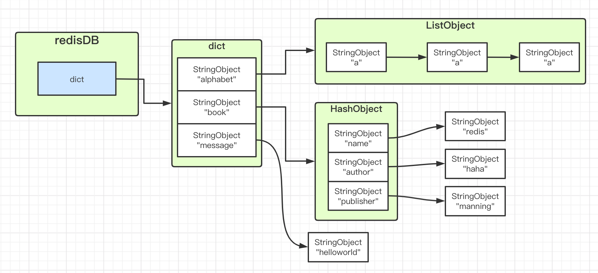
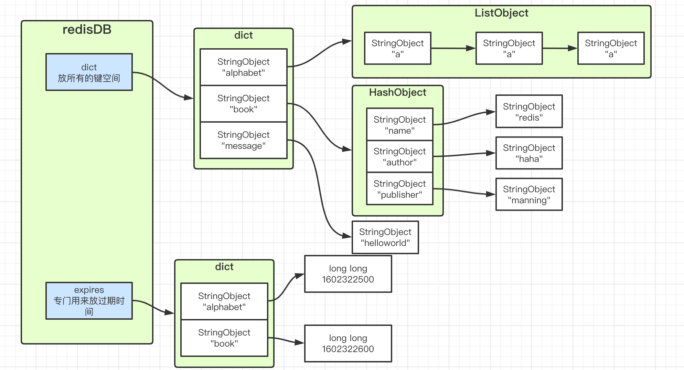

# 服务器的数据库
redisServer结构体维护redis服务器的状态，里面有`400`行！
```
struct redisServer {
    // ...
    redisDb *db;
    int dbnum;                      /* Total number of configured DBs */
    // ...
}
```
redisClient（新版本改名为client啦）结构体维护着客户端的状态：
```
typedef struct client {
    uint64_t id;            /* Client incremental unique ID. */
    connection *conn;
    int resp;               /* RESP protocol version. Can be 2 or 3. */
    redisDb *db;            /* Pointer to currently SELECTed DB. */
    // ....many many fileds 
} client;
```

关键的数据库 redisDb结构：
```
/* Redis database representation. There are multiple databases identified
 * by integers from 0 (the default database) up to the max configured
 * database. The database number is the 'id' field in the structure. */
typedef struct redisDb {
    dict *dict;                 /* The keyspace for this DB */
    dict *expires;              /* Timeout of keys with a timeout set */
    dict *blocking_keys;        /* Keys with clients waiting for data (BLPOP)*/
    dict *ready_keys;           /* Blocked keys that received a PUSH */
    dict *watched_keys;         /* WATCHED keys for MULTI/EXEC CAS */
    int id;                     /* Database ID */
    long long avg_ttl;          /* Average TTL, just for stats */
    unsigned long expires_cursor; /* Cursor of the active expire cycle. */
    list *defrag_later;         /* List of key names to attempt to defrag one by one, gradually. */
} redisDb;
```

其中redisDB的底层结构图如下，核心是dict，键空间：



redisDB中的expires字段，用于存放所有的键的ttl：


上面图片解释，虽然出现2个book和alphabet，但实际上都是指针，不会重复创建对象。


## 设置(expire)过期时间与取消(persist)过期时间
```
127.0.0.1:6379> set haha 111
OK
127.0.0.1:6379> expire haha 111
(integer) 1
127.0.0.1:6379> pttl haha
(integer) 108129
127.0.0.1:6379>
127.0.0.1:6379>
127.0.0.1:6379> persist haha
(integer) 1
127.0.0.1:6379> pttl haha
(integer) -1
```

## Cache的过期的3种策略
```
定时删除（主动 - CPU不友好，内存友好）：timer定时器，时间到了就删除key
惰性删除（被动 - CPU友好，内存不友好）：对请求的key进行check，过期了就删除，如果没有请求来，那么key就一直待着。
定期删除（主动 - CPU折中，内存折中）：每隔一段时间，就对数据库的keys进行一次检查，删除里面过期的keys
```
## Redis采用的过期策略
```
惰性删除（被动 - CPU友好，内存不友好）：对请求的key进行check，过期了就删除，如果没有请求来，那么key就一直待着。
定期删除（主动 - CPU折中，内存折中）：每隔一段时间，就对数据库的keys进行一次检查，删除里面过期的keys
```